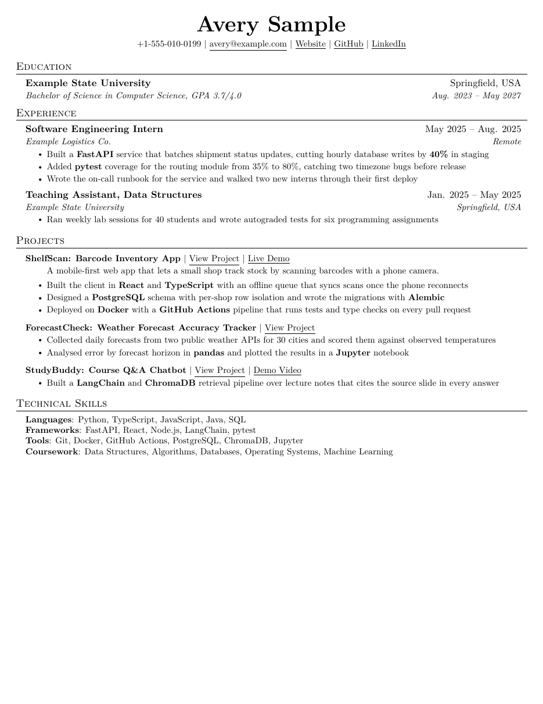

# resume-tailor

An agent skill that tailors a one-page LaTeX resume to a job description, using only facts you
have confirmed from your own GitHub repositories.

Set it up once: it builds a private workspace with your base resume and a facts file drawn from
your repositories. Then, for each job, paste the description and get back a PDF named for the
company and role, still on one page, with every claim traceable and every gap said out loud.

## What it enforces

- **One page.** Checked after every edit, by compiling and counting.
- **No invented facts.** Each project gets a facts entry, confirmed by you, recording what it is
  and the strongest claim it can honestly carry. Tailoring rewords; it never inflates.
- **You decide every cut.** When a page overflows, the agent measures the overflow in lines and
  offers 3-4 complete trim packages. Nothing is cut until you pick one.
- **Bases stay clean.** Each application gets its own copy, so your base resume stays neutral.
- **No em-dashes, plain sentences, honest link labels** (`View Project`, `Live Demo`, `Demo Video`).
- **Gaps said out loud.** A requirement with nothing behind it is reported, not papered over.
- **Look before done.** Every verify run renders page 1 to an image, and the agent reads it.

## Install

**Claude Code**

    /plugin marketplace add ishanavasthi/resume-tailor
    /plugin install resume-tailor@resume-tailor

**Other agents** that support the [Agent Skills](https://agentskills.io) format: copy
`skills/resume-tailor/` into your agent's skills folder. Your agent's documentation says where
that is.

## Requirements

- Python 3.9+ with `pypdf`, `pypdfium2`, and `pillow`, or [`uv`](https://docs.astral.sh/uv/),
  which installs what each script needs
- A TeX engine: `pdflatex` (TeX Live, MacTeX, MiKTeX) or [`tectonic`](https://tectonic-typesetting.github.io)
- The [GitHub CLI](https://cli.github.com), logged in (`gh auth login`), so the agent can read
  your repositories
- Optional: poppler's `pdftoppm` for page previews (`pypdfium2` is the fallback)

## Use it

Ask your agent in plain words:

    Set up my resume workspace.
    Tailor my resume for this job: <paste the description or a link>
    My resume spills onto a second page.
    What should I build to get more backend roles?

## Layout

    skills/resume-tailor/
      SKILL.md        routing and the hard rules
      references/     rules, setup, tailoring, overflow, facts, template, project ideas
      scripts/        build, verify, measure, extract_pdf, init_workspace
      assets/         the LaTeX template and the workspace starter files

Your data never goes in this repository. The workspace the skill creates is yours, and private.

### Your workspace

Setup creates a folder of your own, outside this repository:

    AGENTS.md         instructions any agent reads on entering the folder
    CLAUDE.md         points Claude Code at AGENTS.md
    bases/            your base resumes, one per role family, never tailored in place
    tailored/         one copy per application: Resume-<Company>.tex
    pdfs/             finished PDFs: <First>_<Last>_Resume_<Company>_<Role>.pdf
    notes/
      facts.md        what each project and job actually is; every claim traces here
      variants.md     what each base contains, and the decisions locked in so far
      roles.md        company and role research
      gaps.md         job requirements with nothing behind them, and other open risks

To create one by hand, without an agent:

    uv run skills/resume-tailor/scripts/init_workspace.py ~/resume --name "First Last" --from-template

`--from-template` is optional: it seeds `bases/Resume.tex` from the template. The script never
overwrites an existing file.

## The scripts on their own

They work without an agent:

    uv run skills/resume-tailor/scripts/verify.py my-resume.tex
    uv run skills/resume-tailor/scripts/measure.py my-resume.tex

`verify.py` checks one page, em-dashes, overfull boxes, and leftover placeholders, and renders
page 1. `measure.py` reports how far a page overflows, the text that spilled, and the cheapest
lines to win back.

## Development

    uv run --no-project --with-requirements requirements-dev.txt pytest -q

CI runs the suite with both pdflatex and tectonic.

## Credits

Built by [Ishan Avasthi](https://github.com/ishanavasthi), from a workflow used for real job
applications.

The LaTeX template is [Jake Gutierrez's resume](https://github.com/jakegut/resume) (MIT), itself
based on [sb2nov/resume](https://github.com/sb2nov/resume) (MIT), with wider usable width and
fictional example content.

## License

MIT. See [LICENSE](LICENSE), which also carries the template's upstream notices.
